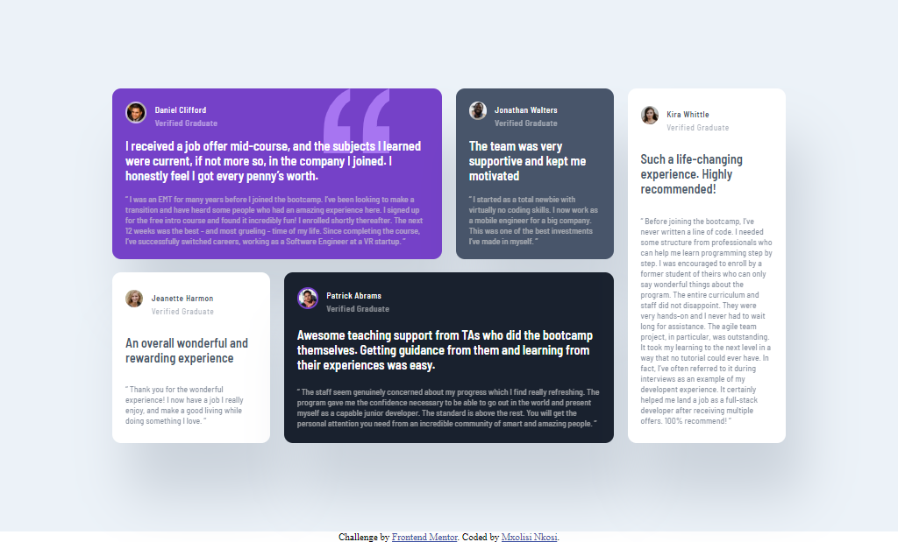

# Frontend Mentor - Testimonials grid section solution

This is a solution to the [Testimonials grid section challenge on Frontend Mentor](https://www.frontendmentor.io/challenges/testimonials-grid-section-Nnw6J7Un7). Frontend Mentor challenges help you improve your coding skills by building realistic projects. 

## Table of contents

- [Overview](#overview)
  - [The challenge](#the-challenge)
  - [Screenshot](#screenshot)
  - [Links](#links)
- [My process](#my-process)
  - [Built with](#built-with)
  - [Useful resources](#useful-resources)
- [Author](#author)

**Note: Delete this note and update the table of contents based on what sections you keep.**

## Overview

### The challenge

Users should be able to:

- View the optimal layout for the site depending on their device's screen size

### Screenshot

#### Desktop

#### Mobile

### Links

- Solution URL: [GitHub](https://github.com/m-nkosi/testimonials.git)
- Live Site URL: [Live](https://aquamarine-macaron-4caf8b.netlify.app)

## My process

### Built with

- Semantic HTML5 markup
- CSS custom properties
- Flexbox
- CSS Grid

### Useful resources

- [Stackoverflow](https://stackoverflow.com/) - This helped me whenever I got stuck
- [MDN](https://developer.mozilla.org/en-US/) - This is an amazing amazing when you must to checkout documentation of html, css and javascript

## Author

- Website - [Github](https://github.com/m-nkosi)
- Frontend Mentor - [@m-nkosi](https://www.frontendmentor.io/profile/m-nkosi)

